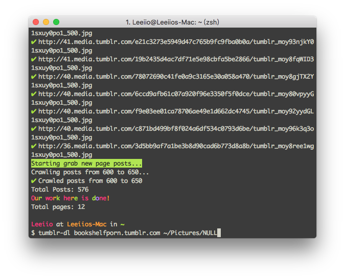

# tumblr-downloader

Easily download all the photos from a Tumblr blog.

[](https://nodei.co/npm/tumblr-downloader/)



## Installation
```
npm install -g tumblr-downloader
```

## Usage
```
Usage: tumblr-dl <url> [<directory>]

eg. tumblr-dl xxx.tumblr.com
eg. tumblr-dl xxx.tumblr.com ~/pictures/xxx.tumblr/

Options:

  -h, --help     output usage information
  -v, --version  output the version number
```

## License
MIT